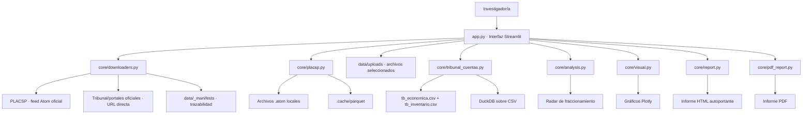
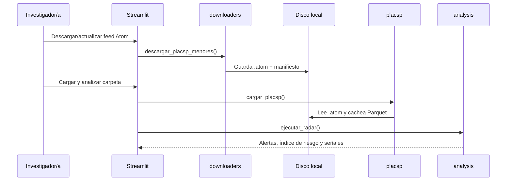
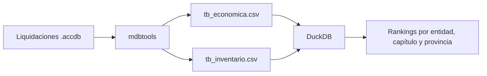

# Arquitectura del proyecto

Auditor de Contratos Públicos es una aplicación local-first construida con Streamlit y módulos Python separados por responsabilidad. La interfaz orquesta la carga, el análisis y la visualización, mientras que `core/` concentra la lógica reutilizable y testeable.

## Principios

- **Local-first:** los datos se procesan en el ordenador del investigador.
- **Trazabilidad:** las descargas generan manifiestos con URL, fecha y ficheros creados.
- **Separación de responsabilidades:** la interfaz no contiene parsers ni consultas pesadas.
- **Reproducibilidad:** los loaders trabajan sobre ficheros locales y las pruebas cubren parsing, radar, descargas y gráficos.

## Diagrama general

## Componentes

| Componente | Responsabilidad |
| --- | --- |
| `app.py` | Interfaz Streamlit, navegación, formularios, presentación de resultados. |
| `core/analysis.py` | Radar de fraccionamiento, parsing de fechas, banderas forenses. |
| `core/constants.py` | Límites legales, patrones regex y provincias de referencia. |
| `core/downloaders.py` | Descargas reproducibles, extracción ZIP segura, manifiestos JSON. |
| `core/money.py` | Normalización y formato de importes en euros. |
| `core/placsp.py` | Lectura streaming de Atom PLACSP y caché Parquet. |
| `core/tribunal_cuentas.py` | Conversión `.accdb` con `mdbtools` y consultas DuckDB sobre CSV. |
| `core/visual.py` | Figuras Plotly desacopladas de Streamlit. |
| `core/report.py` | Informe HTML descargable con tablas y gráficos interactivos. |
| `core/pdf_report.py` | Informe PDF descargable con resumen, tablas e imágenes estáticas. |
| `.streamlit/config.toml` | Configuración local de Streamlit, incluido límite de subida para CSV/ACCDB grandes. |
| `tests/` | Pruebas unitarias del núcleo reutilizable. |

## Flujo PLACSP

## Flujo Tribunal de Cuentas

## Datos y Git

El repositorio no debe incluir descargas completas, cachés, entornos virtuales ni bases pesadas. `.gitignore` excluye `data/`, `.cache/`, `.venv/`, `__pycache__/`, `.pytest_cache/`, `.accdb` y dumps voluminosos. Las fuentes reales se descargan desde la app o se cargan localmente por el investigador.

La app mantiene dos vías de entrada: selector de archivo del navegador para `.atom`, CSV, Excel, PDF y `.accdb`; y campos de ruta local para carpetas completas o ficheros muy grandes. Los archivos seleccionados se copian a `data/uploads/`, carpeta ignorada por Git.
